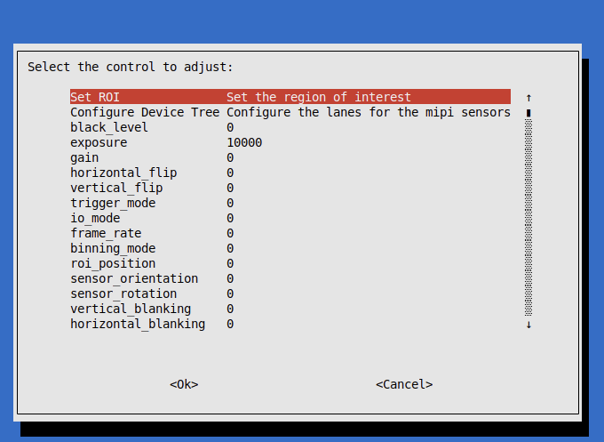
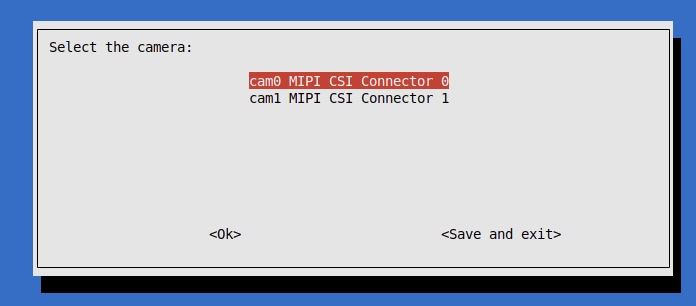
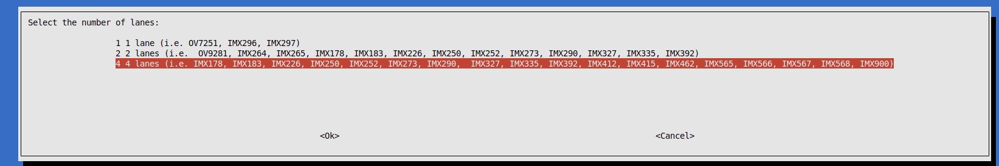
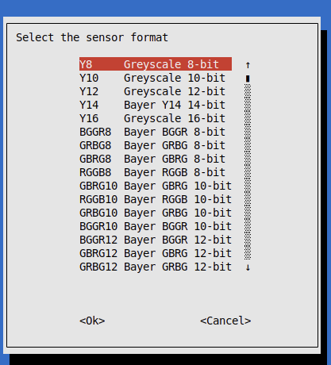
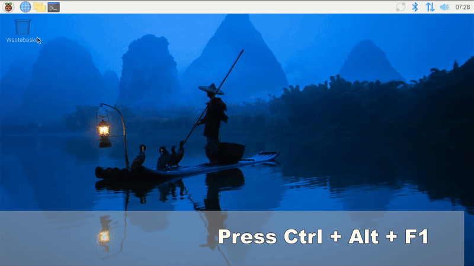

# Raspberry Pi 5 Driver for VC MIPI
This driver package is supporting the official Raspberry Pi 3+, 4 and 5 models and CM. 
Downloads are available under 

[Releases](https://github.com/VC-MIPI-modules/vc_mipi_raspi/releases)

For mechanical installation see [Mechanical installation manual](https://github.com/VC-MIPI-modules/vc_mipi_core/blob/raspberrypi/develop/doc/mechanical_setup.md)

# Installation
The driver is tested on 64-bit Raspberry Pi OS with Bookworm (Lite or with desktop).
The OS can be installed by the official Raspberry Pi Imager from the Raspberry Pi Foundation.

[Raspberry Pi OS](https://www.raspberrypi.com/software/)

Copy the debian package for your target system to the module:
* BCM2712 ⇒ Raspi5, CM5
* BCM2711 ⇒ Raspi4, CM4
* BCM2837 ⇒ Raspi3+, Raspi Zero 2
* VCCMI10 ⇒ [VC MIPI Compute Module Interface Board](https://www.mipi-modules.com/fileadmin/external/documentation/hardware/VC_MIPI_Compute_Module_Interface/index.html)


Run the installation with the installation of the needed packages: 
```
sudo apt install ./vc-mipi-driver-bcm2712_xxx_arm64.deb
```
<b>or</b>
Run the installation with manual packages:
```
sudo apt install dkms linux-headers-generic v4l-utils whiptail
sudo dpkg -i ./vc-mipi-driver-bcm2712_xxx_arm64.deb
```
After a reboot the connected sensor(s) should be detected and visible as v4l2 capture devices
Under the current Raspberry Pi OS with Bookworm, 
the sensors are:

| Camera   | Device      | Subdevice        |
| -------- | ----------- | ---------------- |
| Cam0     | /dev/video0 | /dev/v4l-subdev2 |
| Cam1     | /dev/video8 | /dev/v4l-subdev5 |


# Build from source

See [Build from Source](./docs/build_from_source.md)

# Configuration on Raspberry Pi 5

1. The configuration for the VC MIPI Sensors is in the boot file 
<i>/boot/firmware/config_vc-mipi-driver-bcm2712.txt</i>. 
The right lanes configuration for the sensors has to be made. For some sensors, 2 modes are available. 
If no specific configuration is needed, the "more lanes" configuration is the first choice (i.e. 4 instead 2 lanes)
2. Additionally the configuration tool vc-config is installed. By calling ```vc-config```
it is possible to change the values of the controls and also the region of interest (ROI)
3. The formats can be adjusted. All formats are displayed, although not all are available which depends on the sensor model.






# ISP and Libcamera Support
For Libcamera support, refer to [Libcamera Installation](./docs/libcamera.md)
Then the ISP with features like Auto White Balancing (AWB) are supported.

# Support Tool
## Installation
The official support tool for the v4l2 driver is 
[V4L2-Test](https://github.com/pmliquify/v4l2-test/tree/feature/gstreamer)

⚠️ **Important:** Checkout branch feature/gstreamer for full raspberrypi compliance
Please refer to the installation there. 

## Usage
For starting, you have to add the subdevice properly in order to set the controls by tool:
```shell
./v4l2-test stream -e <exposure> -g <gain> -f <pixelformat> -p 1 -d <device> -sd <subdevice>
# Camera 0
./v4l2-test stream -e <exposure> -g <gain> -f <pixelformat> -p 1 -d /dev/video0 -sd /dev/v4l-subdev2
# Camera 1
./v4l2-test stream -e <exposure> -g <gain> -f <pixelformat> -p 1 -d /dev/video8 -sd /dev/v4l-subdev5
```
## Display live image

For getting the live image on the screen, add the argument `--fb`

```shell
./v4l2-test stream -e <exposure> -g <gain> -f <pixelformat>  -d <device> -sd <subdevice> --fb
# Camera 0
./v4l2-test stream -e <exposure> -g <gain> -f <pixelformat>  -d /dev/video0 -sd /dev/v4l-subdev2 --fb
# Camera 1
./v4l2-test stream -e <exposure> -g <gain> -f <pixelformat>  -d /dev/video8 -sd /dev/v4l-subdev5 --fb
```

On desktop version, first you have to switch to console mode `Ctrl + Alt + F1`



# Controls
1. [Black level](./docs/black_level.md)
2. [IO Mode](./docs/io_mode.md)
3. [Trigger mode](./docs/trigger_mode.md)
4. [Binning mode](./docs/binning_mode.md)

# Known issues

The driver offers the basic features of the VC MIPI sensors. 
This has the advantage that the same functions are available with all sensors. 
If special functions are required, please contact the support team or your contact at Vision Components GmbH 

1. The flipping controls are not supported by standard driver

<b>[FAQ](./docs/faq.md)
