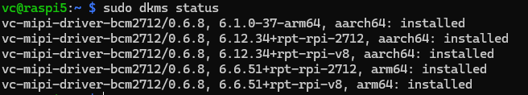

# Setting controls

```shell
v4l2-ctl -c <control>=<value> -d <subdevice>
#Example for first camera
v4l2-ctl -c black_level=1000 -d /dev/v4l-subdev2
```

# Change lanes settings by bash command

```shell
sudo sed -i "s/^dtoverlay=vc-mipi-bcm2712-<0|1>,lanes[0-9]*/dtoverlay=vc-mipi-bcm2712-<0|1>,lanes<1|2|4>/" "/boot/firmware/config_vc-mipi-driver-bcm2712.txt"
#Example for first camera and 2 lanes
sudo sed -i "s/^dtoverlay=vc-mipi-bcm2712-0,lanes[0-9]*/dtoverlay=vc-mipi-bcm2712-0,lanes2/" "/boot/firmware/config_vc-mipi-driver-bcm2712.txt"
```
# Connection issues

```shell
sudo dmesg | grep vc_mipi_camera
```
## Indication that sensor is not well connected

<b><span style="color:green">[    x.xxxxx]</span> <span style="color:yellow">vc_mipi_camera 4-001a: </span><span style="color:red">
vc_mod_setup(): Unable to get module I2C client for address 0x10</span></b>

## Indication that lanes are not configure properly

<b><span style="color:green">[    x.xxxxx]</span><span style="color:yellow"> vc_mipi_camera 4-001a: </span><span style="color:#d6281c">
 vc_core_set_num_lanes(): Number of lanes 1 not supported!</span><b>


# Full upgrade of debian

Often, at an full-upgrade a new kernel is installed. 
The kernel module for the VC driver has to be reinstalled for the kernel as in the following instructions:

The driver is not loaded and the dmesg shows an error like:
```
vc_mipi_modules disagree about version of module layout
```
1. Check current version of driver by ```sudo dkms status```



2. Rebuild Kernel Module 
```shell
sudo dkms install vc-mipi-driver-bcm2712/<VERSION_FROM_STATUS> -k $(uname -r) --force
```
3. Install Kernel Module for kernel version
```shell
sudo dkms install vc-mipi-driver-bcm2712/<VERSION_FROM_STATUS> -k $(uname -r) --force
```