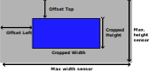

# Live ROI (Region of Interest)
In case of a cropped image, 
the ROI can be shifted during streaming.
The cropping (width x height) has to be done first with media-ctl.
The value is a combined value with the following formatting.

The first  4 digits are the offset to the top.
The second 4 digts are the offset from the left
The 9th digit is the binning (Not supported on all sensors)
B_LLLL_TTTT

Example:

001110333 => 111 bits shifted from left, 333 bits shifted from top

``` shell
v4l2-ctl -d <SUBDEV> -c live_roi=value
```
