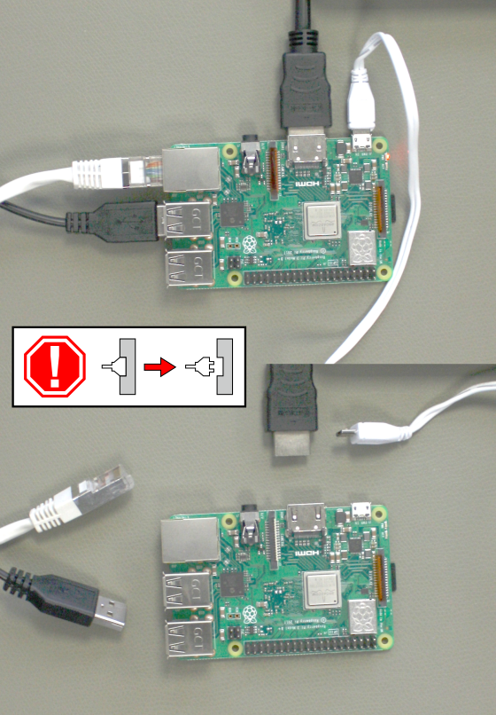
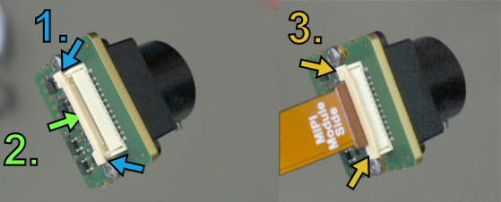
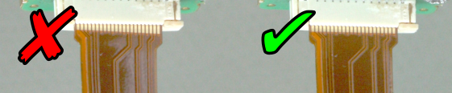
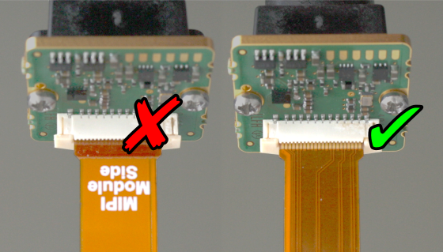
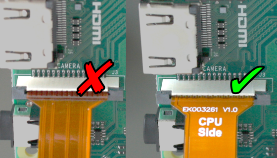

# Connect MIPI modules

> [!WARNING]  
> Always disconnect all cables before connecting or disconnecting the MIPI module!

The ends of the MIPI module connector cable is marked with the hardware to connect to. Open the socket connectors first by raising their lid, insert the cable and press their lid back when mounted correctly. You should then not be able to pull the cable out.

Open the MIPI module socket, put in the cable, close the MIPI module socket

> [!WARNING]  
> The connection at this type of socket is not protected against bad alignment, so always check the orthogonality, and if it is bent, correct it! Also watch out for the right orientation of the cable! The MIPI module or the board connected on the other side can be irrevocably damaged if the cable is not inserted the right way, and warranty is lost!

Harmfully angled (left) and good (right) cable fixation
The socket type is also not protected against wrong orientation, so compare your setup to the figures below before switching the power on.

*Watch the orientation of the cable (left: bad, right: good)*

There may be a dust prevention sticker at the socket named CAMERA at the raspberryPi, remove it first. Like at the sensor module, open the lid first, insert the cable to be orthogonally fixed after shutting the lid. Also check the orthogonality here and correct it if the cable is angled!

*Connect the cable to the CAMERA socket at the raspberry Pi equally (left: bad, right: good)*

> [!WARNING]  
> Do not connect other devices to the I²C bus named VC, since it can affect the communication between the camera sensor and the driver!
> 
> For example, running the touch screen of the Raspberry PI 7 inch display will lead to communication problems between driver and camera sensor. The display may work with the following line appended to the /boot/config.txt, but test first without connecting it to the Raspberry PI to be sure everything works so far:
> 
> disable_touchscreen=1
> Don't connect the SDA/SCK of the 7 inch display since this would connect the I²C bus VC from the socket named DISPLAY with the I²C bus ARM at the pinout!