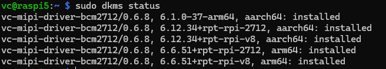

# Troubleshooting

## Problem - Sensor connection or lane configuration issues

### Identification

- Filter kernel logs for the driver:

```sh
sudo dmesg | grep vc_mipi_camera
```

- Typical messages you may see:

```text
[    x.xxxxx] vc_mipi_camera 4-001a: vc_mod_setup(): Unable to get module I2C client for address 0x10
[    x.xxxxx] vc_mipi_camera 4-001a: vc_core_set_num_lanes(): Number of lanes 1 not supported!
[    x.xxxxx] vc_mipi_camera 4-001a:  No image recorded for /dev/video0
```

---

### Reason

- Physical connection issues: ribbon cable not seated, reversed, or connector damaged.
- Sensor not powered or not responding on I2C/SPI.
- Device-tree / overlay misconfigured: lane count, port, or pinmux doesn't match the sensor.

---

### Resolution

1. Power down the board (if possible) and reseat the camera ribbon and connector; verify correct orientation.
2. Confirm the sensor board receives power and any required jumpers are set.
3. Probe the bus to check sensor presence (bus number may vary):

```sh
sudo apt update && sudo apt install -y i2c-tools
sudo i2cdetect -y 1   # adjust bus number if needed
```

4. Verify and apply the correct overlay / device-tree settings for your board and sensor (lane count, port mapping).
5. Reboot and re-check logs:

```sh
sudo reboot
sudo dmesg | grep vc_mipi_camera
```

If the errors disappear the issue is resolved. If they persist, collect `dmesg` output and hardware details for further diagnosis.

---

## Problem - Kernel module version mismatch after a system upgrade

### Identification

- After a kernel upgrade the driver may fail to load with messages like:

```text
vc_mipi_modules disagree about version of module layout
```

- Check DKMS status:

```sh
sudo dkms status
```

---

### Reason

- A new kernel was installed but the VC MIPI kernel module was not rebuilt/installed for the running kernel (DKMS did not succeed or was not triggered).

---

### Resolution

1. Inspect `dkms status` and note the installed `vc-mipi-driver-<variant>/<version>` entry.
2. Reinstall the module for the current kernel (replace `<VERSION>` with the version shown by `dkms status`):

```sh
sudo dkms build vc-mipi-driver-bcm2712/<VERSION> -k $(uname -r) 
sudo dkms install vc-mipi-driver-bcm2712/<VERSION> -k $(uname -r) --force
```

3. Repeat for the variant matching your board if different (e.g., `bcm2711`, `bcm2837`, `rp3a0`, `vccmi10`).
4. Reboot or reload the module and verify:

```sh
sudo reboot
sudo dmesg | grep vc_mipi_camera
```




4. Verify and apply the correct overlay / device-tree settings for your board and sensor (lane count, port mapping).
5. Reboot and re-check logs:

```sh
sudo reboot
sudo dmesg | grep vc_mipi_camera
```

If the errors disappear the issue is resolved. If they persist, collect `dmesg` output and hardware details for further diagnosis.

---

## Problem - Libcamera not working

### Identification

The tools in gstreamer or rpicam-apps do not start and show error messages like these:
```
rpicam-hello
[0:10:40.680543521] [7689]  INFO Camera camera_manager.cpp:327 libcamera v0.0.0+5323-42d5b620
[0:10:40.692524255] [7690]  INFO RPI pisp.cpp:720 libpisp version v1.2.1 f173887f90ef 29-01-2026 (16:44:37)
[0:10:40.695836479] [7690] ERROR IPAProxy ipa_proxy.cpp:154 Configuration file 'vc_mipi_camera.json' not found for IPA module 'rpi/pisp'
[0:10:40.695893960] [7690]  WARN RPiController controller.cpp:91 Failed to open tuning file ''
[0:10:40.695904571] [7690] ERROR IPARPI ipa_base.cpp:152 Failed to load tuning data file 
[0:10:40.695916405] [7690] ERROR RPI pipeline_base.cpp:814 Failed to load a suitable IPA library
[0:10:40.695922349] [7690] ERROR RPI pisp.cpp:947 Failed to register camera vc_mipi_camera 11-001a: -22
Preview window unavailable
ERROR: *** no cameras available ***
```

### Reason 

Libcamera needs configuration files for the ISP. 
During the installation of the fork from VC, these files are installed. 
If the installation fails or afterwards libcamera or libcamera-apps which are from standard debian repository are reinstalled, 
the pipeline cannot be started.

### Resolution

1. Remove all prebuilt packages ```sudo apt-get remove libcamera-*```
2. Install the libcamera again from here: [Libcamera Installation](./libcamera.md)